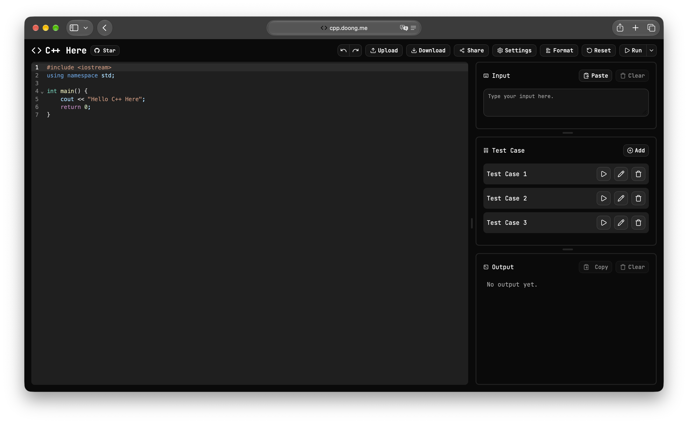

# C++ Here - Online C++ Editor

C++ Here is a next-generation in-browser (online) C++ editor built for competitive programming, engineered to be fast, lightweight, and full-featured.

> [!NOTE]
> This readme also has a [Traditional Chinese version](README-TW.md).

> [!TIP]
> Try it now: https://cpp.doong.me



## Features

- **Error Highlighting**
- **Built-in Test Case Support**
- **Automatic Code Formatting**
- **Internationalization and Localization (i18n)**
- **Auto-completion**
- **Responsive Design (RWD)**
- **Online Compilation and Instant Execution**
- **Simple but Powerful Editor**
- **Smart Compilation Cache**
- **One-click Test Data Import**
- **Open Source and Free**

## Tech Stack & Dependencies

- **Frontend**: Astro, Bun, Motion, React, Shadcn, Tailwind CSS, TypeScript, axios, cloudflare turnstile, codemirror, i18next, Jotai Atom, lucide
- **Browser Extension**: Bun, TypeScript, esbuild, web-ext
- **Backend**: FastAPI, PyJWT, PyTurnstile, Python, SQLAlchemy, Uvicorn, aiodocker, aiofiles, aiosqlite, apscheduler, [safe-cpp2wasm](https://github.com/Dong-Chen-1031/safe-cpp2wasm/)

## Principles and Advantages

The main difference between C++ Here and other online C++ editors is that we use [safe-cpp2wasm](https://github.com/Dong-Chen-1031/safe-cpp2wasm/) to compile C++ files into WebAssembly and execute them directly in the frontend. The advantages of this approach are:

1. **Fast**: Since the compiled WebAssembly modules can run directly in the browser, there is no need to rely on the backend for execution every time, significantly improving execution speed.
2. **Secure**: WebAssembly runs in the browser and features sandbox isolation, which effectively prevents malicious code from threatening the system.
3. **Concurrent**: Executing WebAssembly modules on the frontend can leverage the browser's multi-threading capabilities for more efficient concurrent execution, which is particularly suitable for handling numerous test cases in competitive programming.
4. **Unlimited**: Because the execution happens on the frontend, users are not constrained by backend computing resources. They can freely write and test code without worrying about overloading the server.

## Local Development

### Frontend

Bun (recommended) or npm both work — the repo is a workspace monorepo, so run every command below from the repository root.

1. Clone

```shell
git clone https://github.com/Dong-Chen-1031/CPP-here.git
cd CPP-here
```

2. Install dependencies

```shell
bun install
# or
npm install
```

3. Run frontend

```shell
bun run frontend
# or
npm run frontend
```

> [!TIP]
> Every setting works out of the box. To change one, copy `frontend/.env.example` to
> `frontend/.env` — each variable is documented inline with its default and whether it is
> read at build time or at runtime.

### Backend

Python 3.14 + UV is recommended.
Make sure Docker is running.

1. Clone

```shell
git clone https://github.com/Dong-Chen-1031/CPP-here.git
cd CPP-here
```

2. Install dependencies

```shell
uv venv
source .venv/bin/activate  # Adjust for your operating system
uv pip install -r backend/requirements.txt
```

3. Pull Docker image

```shell
docker pull ghcr.io/dong-chen-1031/safe-cpp2wasm:latest
```

4. Run backend

```shell
bun run backend
# or
npm run backend
```

> [!TIP]
> Every setting works out of the box. To change one, copy `backend/.env.example` to
> `backend/.env` — each variable is documented inline with its default.

### Run Frontend and Backend Together (Recommended)

1. Complete the environment setup above.
2. Start both frontend and backend with one command:

```shell
bun run dev
# or
npm run dev
```

### Code Formatting

`bun install` / `npm install` sets up a Git pre-commit hook (Husky + lint-staged) that formats
staged files before each commit: Prettier for `frontend/`, Ruff for `backend/` Python files.
Ruff runs through `uvx`, so [uv](https://docs.astral.sh/uv/) must be installed. CI runs the same checks.

```shell
bun run format        # format frontend and backend
bun run format:check  # check frontend only, as CI does
```

## Deployment

### Full deployment with Docker Compose

```shell
curl -sS "https://cpp.doong.me/script/docker-compose.yml" > docker-compose.yml
docker compose up --pull always
```

> [!TIP]
>
> - Add `-d` to the second command to run in background mode.
> - You can modify environment variables based on the comments inside `docker-compose.yml`.

> [!WARNING]
> Since the backend needs to create ephemeral containers to build user code, Docker Compose mounts the Docker socket into the container. On operating systems other than Linux and macOS, additional adjustments may be required.

<details>
<summary>Build Docker images manually</summary>

#### Clone

```shell
git clone https://github.com/Dong-Chen-1031/CPP-here.git
cd CPP-here
```

#### Build frontend

```shell
docker build \
  -f ./docker/frontend/Dockerfile \
  -t cpp-here-frontend:latest \
  .
```

#### Build backend

```shell
docker build \
  -f ./docker/backend/Dockerfile \
  -t cpp-here-backend:latest \
  .
```

</details>

### Deploy frontend

- The frontend uses Astro SSG mode. After running `bun run build`, it outputs a **fully static** website that can be easily deployed to services such as Cloudflare Pages and GitHub Pages. This approach is highly recommended because it improves loading speed and reduces backend workload.

- Deploy frontend with Docker Compose in one command (the image uses Caddy as the web server):

```shell
curl -sS "https://cpp.doong.me/script/frontend/docker-compose.yml" > docker-compose.yml
docker compose up --pull always
```

### Deploy backend

Docker Compose is recommended for backend deployment, as it automatically handles dependencies, versions, and environment setup.

```shell
curl -sS "https://cpp.doong.me/script/backend/docker-compose.yml" > docker-compose.yml
docker compose up --pull always
```

> [!WARNING]
> Since the backend needs to create ephemeral containers to build user code, Docker Compose mounts the Docker socket into the container. On operating systems other than Linux and macOS, additional adjustments may be required.

## Contributing

Any contributions are greatly appreciated. If you have suggestions for improvement, please fork this repository and create a Pull Request. You can also [open an issue](https://github.com/Dong-Chen-1031/Cpp-Here/issues).

## License

This project is licensed under the [MIT LICENSE](LICENSE).
