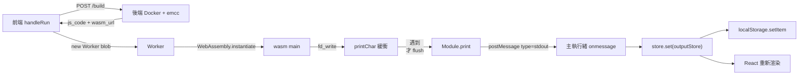

> 以下使用 Claude 進行之研究報告，未使用其生成程式碼，單純進行詢問並作為參考

# 大量輸出（OLE）導致 C++ Here 閃退 — 研究報告

- 日期：2026-09-11
- 觸發案例：Discord 上回報的程式碼
- 結論先講：**這不只是「輸出太長」的顯示問題，而是四個獨立的無上限設計疊加**。其中兩個（Worker 端的 stdout 緩衝、主執行緒的 `atomWithStorage` 持久化）即使在「正常大小」的輸出下也已經會讓頁面卡死，必須一起處理，只做「偵測輸出太長就中斷」擋不住全部情況。

---

## 1. 觸發案例

```cpp
#include<bits/stdc++.h>
using namespace std;
#define int long long
// ...
signed main()
{
  ios::sync_with_stdio(0);
  cin.tie(0);
  for(int i=0;i<100000000;i++)cout<<1;   // 1e8 個字元，且「沒有換行」
}
```

這段有兩個關鍵特徵，會走到**兩條不同的崩潰路徑**：

| 變體 | 程式碼 | 崩潰位置 | 機制 |
|---|---|---|---|
| A（本案例） | `cout<<1`（**無換行**） | Worker（wasm 端） | Emscripten 的 stdout 緩衝區是一個永不 flush 的 JS 陣列，1e8 個位元組 → 約 2.2 GB 堆積 → V8 OOM |
| B | `cout<<1<<'\n'`（**有換行**） | 主執行緒 | 1e8 次 `postMessage` + 每次都做「全量字串 concat + `JSON.stringify` + `localStorage.setItem`」→ O(n²) → 主執行緒凍結 / OOM |

兩者最終使用者看到的都是「閃退」。V8 的 OOM 是 fatal error，會直接終止整個 renderer 行程（Chrome 顯示 *Aw, Snap!*），不是只關掉那個 Worker——所以整個分頁消失。手機版瀏覽器的堆積上限通常只有幾百 MB，會**更早**崩潰。

---

## 2. 執行架構回顧



相關檔案：

| 檔案 | 角色 |
|---|---|
| `backend/services/build.py:113-141` | emcc 編譯參數 |
| `backend/assets/worker.js` | 注入到 Worker 的執行殼層（`print` / `printErr` / `stdin`） |
| `frontend/src/api/run.ts:145-230` | `runCode()`：建立 Worker、收訊息、分派 callback |
| `frontend/src/api/run.ts:328-347` | `handleRun()` 的 `onStdout` |
| `frontend/src/store/atom.ts:83` | `outputStore`（**持久化到 localStorage**） |
| `frontend/src/components/panel/OutputPanel.tsx:91-139` | 輸出渲染 |

---

## 3. 根因分析

### 3.1 根因 A：`-sFILESYSTEM=0` 下的 stdout 是「逐位元組 push 進 JS 陣列、遇到換行才 flush」

`backend/services/build.py:132` 使用 `-sFILESYSTEM=0`，所以 Emscripten 走的是 `SYSCALLS_REQUIRE_FILESYSTEM=0` 的簡化 stdout 路徑（`src/lib/libwasi.js`）：

```js
// fd_write（無檔案系統版本）
for (var j = 0; j < len; j++) {
  printChar(fd, HEAPU8[ptr+j]);      // ← 一次一個位元組
}

$printChar: (stream, curr) => {
  var buffer = printCharBuffers[stream];
  if (!curr || curr === 10) {         // ← 只有 '\n' 或 '\0' 才會吐出去
    (stream === 1 ? out : err)(UTF8ArrayToString(buffer));
    buffer.length = 0;
  } else {
    buffer.push(curr);                // ← 否則無上限地累積
  }
}
```

**這代表 `Module.print` 對「沒有換行的輸出」根本不會被呼叫一次。** 所以：

- 任何「在 `print` 裡面計算輸出量、超過就中斷」的做法，對本案例（變體 A）**完全無效**，因為它永遠不會被觸發。
- 緩衝區是一個**普通 JS `Array`**（不是 TypedArray），每個元素在 V8 裡至少 8 bytes，加上成長時的重新配置。

實測（Node 22 / V8，模擬同樣的 push 迴圈）：

| 輸出位元組數 | push 耗時 | 新增堆積 |
|---|---|---|
| 1e6 | 0.17 s | 29 MB |
| 1e7 | 1.5 s | 295 MB |
| 5e7 | 4.5 s | 637 MB |
| **1e8（本案例）** | **11.9 s** | **2242 MB** |

2.2 GB 已經超過大多數瀏覽器分頁的 V8 堆積上限 → OOM → 分頁崩潰。**這就是閃退的直接原因。**

另外，就算沒 OOM，程式結束時 `-sEXIT_RUNTIME=1` 會觸發 `flush_NO_FILESYSTEM()` → `UTF8ArrayToString(buffer)`。因為 buffer 是普通 Array 沒有 `.buffer`，走的是**不能用 TextDecoder 的逐字元 `str += String.fromCharCode(...)` 慢路徑**，會再生出一個 1e8 字元（約 200 MB）的字串，然後用 `postMessage` 結構化複製一份到主執行緒（再 200 MB）。

> 附帶影響：即使是合法的大量輸出（例如輸出 100 萬行答案），這條「每個位元組一次 JS 函式呼叫 + array push」的路徑也慢得離譜，是目前重輸出題目的效能瓶頸。

### 3.2 根因 B：`outputStore` 是 `atomWithStorage`，每一則 stdout 訊息都把「整份輸出」序列化寫進 localStorage

`frontend/src/store/atom.ts:83`：

```ts
export const outputStore = atomWithStorage<OutputCase[]>("output", []);
```

jotai 的 `atomWithStorage` 預設用 `createJSONStorage(() => localStorage)`，而它的 `setItem` 是：

```ts
setItem: (key, newValue) =>
  getStringStorage()?.setItem(key, JSON.stringify(newValue, options?.replacer)),
```

**每一次 `store.set(outputStore, ...)` 都會同步做一次「整份輸出的 JSON.stringify + localStorage.setItem」。** 再加上 `frontend/src/api/run.ts:328-347` 的寫法本身就是全量字串重組：

```ts
onStdout: (output) => {
    store.set(outputStore, (prev) => [
        { content: (prev[prev.length - 1]?.content || "") + output + "\n" },
    ]);
},
```

於是每收到一行就是 O(累積長度)，整體 O(n²)。實測（只算 `JSON.stringify`，還沒算真正 localStorage I/O）：

| 行數（每行 10 字元） | 實際輸出大小 | 主執行緒阻塞時間 | 累計序列化量 |
|---|---|---|---|
| 1,000 | 10.7 KB | 0.02 s | 5.7 MB |
| 5,000 | 53.7 KB | 0.32 s | 143 MB |
| 20,000 | 214.8 KB | **7.7 s** | 2.3 GB |
| 50,000 | 537.1 KB | **53.8 s** | 14.3 GB |

也就是說：**只要輸出 5 萬行（區區 0.5 MB，競程裡再正常不過），主執行緒就會被鎖死將近一分鐘**，這時候使用者連「Stop」按鈕都按不到（`runBtn.tsx:147-151` 的 terminate 需要主執行緒回應事件）。這是本次事件之外、獨立存在的嚴重效能 bug。

還有兩個附帶問題：
1. **QuotaExceededError**：localStorage 上限約 5 MB，超過就丟例外。jotai 的 `setItem` **沒有 try/catch**，例外會從 `store.set` 一路丟到 `worker.onmessage` 裡變成未捕捉錯誤，之後每一則訊息都再丟一次——使用者看到的是「輸出突然不再更新」，而且沒有任何錯誤提示。
2. **崩潰狀態會被持久化**：如果有一份接近 5 MB 的輸出成功寫進 localStorage，下次開啟頁面時 `atomWithStorage` 會 `JSON.parse` 它並渲染，等於**每次重新整理都會再卡一次**，直到使用者自己清 localStorage。

### 3.3 根因 C：Worker → 主執行緒沒有任何批次化或背壓

`backend/assets/worker.js:23-25` 是一行一則訊息：

```js
print: function (text) {
    self.postMessage({ type: "stdout", taskId, content: text });
},
```

變體 B（每個數字都換行）會產生 1e8 則訊息。Worker 的 `postMessage` 不會等主執行緒消化，訊息全部堆在主執行緒的事件佇列裡，**佇列本身就會吃光記憶體**；而主執行緒每處理一則又要付 3.2 的 O(n) 成本，永遠追不上生產速度。

`handleRunAll()` 更糟：每個測資一個 Worker 平行跑（`run.ts:435-491`），N 個 Worker 同時灌，而且 `insertInOrder()`（`run.ts:350-385`）每則訊息都做一次字串合併 + 陣列重建，`onExit` 還會再 `filter/map/join` 整份輸出一次。

### 3.4 根因 D：渲染端也沒有上限

`OutputPanel.tsx:138` 把整份輸出塞進單一個 `<p>`，而且套了 `whitespace-pre-wrap break-all`：

```tsx
<p>{line.content}</p>
```

100 MB 的文字節點 + 逐字元斷行的排版計算，光是 layout 就足以讓分頁死掉。`OutputPanel.tsx:40` 的複製按鈕 `navigator.clipboard.writeText(output[0].content)` 同理。

### 3.5 根因 E：整個執行流程沒有任何資源限制

目前前端執行 wasm **完全沒有**：

- ❌ 時間限制（TLE）——無窮迴圈會一直跑到使用者關分頁
- ❌ 輸出限制（OLE）——本案例
- ❌ 記憶體限制（MLE）——`build.py:140` 用 `-sALLOW_MEMORY_GROWTH=1` 且**沒有設 `-sMAXIMUM_MEMORY`**，註解也寫明「上限為瀏覽器可用記憶體」。一個 `while(1) v.push_back(1);` 會吃到整個分頁 OOM，症狀和本案例一模一樣。

唯一的中斷手段是 Stop 按鈕，但它依賴主執行緒還活著——而上述任一情況都會先把主執行緒弄死。

> 後端反而是有限制的（`build.py:36-47`：1 CPU / 1 GB / pids 50 / fsize 50 MB / `timeout 30s emcc`）。問題完全出在「前端執行」這一段，因為架構上執行是在使用者瀏覽器裡，後端的沙箱限制管不到。

---

## 4. 回答 Discord 上的兩個問題

> **owl**：「看暫存區還有標準輸出的量值，在承受不住之前強制結束並報錯」
> **Dong**：「是指說偵測到輸出已經太長了就強制中斷嗎？」

方向正確，但有一個**重要的陷阱**：

**在目前的編譯參數下，「輸出量」這個數字在 `Module.print` 這一層是量不到的。** 因為 `print` 只有在遇到換行時才會被呼叫，而本案例（`cout<<1` 不換行）從頭到尾一次都不會呼叫。等到能量到的時候，記憶體已經爆了。

所以正確的防線必須是**分層**的：

1. 在**真正的來源**（`fd_write` / emcc 參數）設硬上限 → 才擋得住「無換行」的情況；
2. 在 **Worker 的 `print`** 設計數 → 擋一般有換行的大量輸出，而且順便做批次化；
3. 在**主執行緒**設 wall-clock watchdog → 對「Worker 完全不發訊息」的情況（本案例）是唯一的保險絲；
4. 在 **UI/儲存層**設顯示上限 → 就算輸出合法地很大，也不能把頁面弄死。

---

## 5. 建議方案

### 5.0 建議的限制數值（可放在 `frontend/src/config/constants.ts`，並在設定面板開放調整）

| 項目 | 建議值 | 說明 |
|---|---|---|
| 時間限制 TLE | 10 s（可設 1–60 s） | 主執行緒 watchdog，順便補上競程需要的 TLE 功能 |
| 輸出硬上限 OLE | 32 MiB | 超過直接中止執行並報「Output Limit Exceeded」 |
| UI 顯示上限 | 2 MiB / 5000 行 | 超過只顯示前段 + 「輸出已截斷，可下載完整輸出」 |
| 記憶體上限 MLE | 256–512 MB | `-sMAXIMUM_MEMORY`，超過會是乾淨的 abort 而不是分頁崩潰 |
| postMessage 批次 | 64 KiB 或 50 ms | 把每行一則改成整塊送 |
| localStorage 持久化 | 只存前 64 KB，或乾脆不存 | 見 5.4 |

### 5.1 第 0 層（最便宜，先做）：加上 `-sMAXIMUM_MEMORY`

`backend/services/build.py:140` 附近：

```python
"-sALLOW_MEMORY_GROWTH=1 ",
"-sMAXIMUM_MEMORY=536870912 ",   # 512 MB 上限
"-sABORTING_MALLOC=1 ",          # 配置失敗 → 乾淨 abort，而不是拖垮整個分頁
```

這一行就把「記憶體爆掉型」的閃退（MLE）變成一個可以顯示給使用者的錯誤訊息。**注意：它擋不住本案例**，因為本案例爆的是 JS 堆積（Worker 裡的 JS 陣列），不是 wasm 線性記憶體——`MAXIMUM_MEMORY` 管不到 JS 堆積。這是兩個不同的記憶體空間，別搞混。

### 5.2 第 1 層（治本）：在 `fd_write` 攔截，取代逐位元組緩衝

專案已經有 `--js-library /tmp/stdin_lib.js`（`build.py:133`）的先例，同樣手法可以覆寫 `fd_write`。概念草案：

```js
// stdout_lib.js
addToLibrary({
  $ohState: "{ total: 0, limit: 33554432, dec: new TextDecoder('utf-8') }",
  fd_write__deps: ['$ohState'],
  fd_write: (fd, iov, iovcnt, pnum) => {
    var num = 0;
    for (var i = 0; i < iovcnt; i++) {
      var ptr = HEAPU32[iov >> 2], len = HEAPU32[(iov + 4) >> 2];
      iov += 8;
      if (fd === 1) {
        ohState.total += len;
        if (ohState.total > ohState.limit) {
          throw new Error("__OLE__");     // 由 JS import 丟出的例外會直接解開 wasm 呼叫堆疊
        }
      }
      // 整塊解碼，不再逐位元組 push（stream:true 處理跨界的多位元組字元）
      var text = ohState.dec.decode(HEAPU8.subarray(ptr, ptr + len), { stream: true });
      if (text) (fd === 1 ? out : err)(text);
      num += len;
    }
    HEAPU32[pnum >> 2] = num;
    return 0;
  },
});
```

好處：

- **無換行的輸出也擋得住**，因為計數發生在真正寫出的地方。
- 順便解決 3.1 的效能問題（整塊 `TextDecoder` vs. 逐位元組 push），重輸出題目會快非常多。
- 從 JS import 丟出的例外會直接解開 wasm 的呼叫堆疊，`createMyModule()` 的 Promise 會 reject，`worker.js:45-47` 現有的 `catch` 就能把它變成 `{type:"error"}` 回報給前端。

需要注意/實測的點：

- 這會改變**行緩衝語意**：`out()` 收到的不再保證是「一整行、不含換行」，而是任意大小的原始區塊。所以 `backend/assets/worker.js` 和 `frontend/src/api/run.ts:330`（目前會自己補 `"\n"`）的契約要一起改，否則輸出會多換行 / 少換行。測資比對（`run.ts:459-476` 的 `trim()` / `join("\n")`）也要跟著檢查。
- `-sALLOW_MEMORY_GROWTH=1` 之下記憶體成長後 `HEAPU8` 會換成新的 view，所以一定要每次重新讀取全域 `HEAPU8`（上面的寫法是對的，不要把 view 快取起來）。
- 使用者的 js-library 覆寫系統 library 符號時 emcc 可能會出警告，需要實測確認覆寫真的生效（也要確認 `stdin_lib.js` 不會被一起影響）。
- 這需要改 `safe-cpp2wasm` 映像，或在 `build.py` 的 `sh -c` 指令裡用 heredoc 先把檔案寫進 `/tmp` 再 `--js-library`（後者可以完全在本 repo 內完成）。

### 5.3 第 2 層：Worker 端計數 + 批次送出

`backend/assets/worker.js`，就算沒做 5.2 也建議先做這個（對「有換行」的大量輸出立刻有效，而且是純前端改動）：

```js
const OUTPUT_LIMIT = 32 * 1024 * 1024;   // 硬上限
const FLUSH_BYTES  = 64 * 1024;          // 批次門檻

let total = 0, pending = [], pendingBytes = 0;

function flush() {
    if (!pendingBytes) return;
    self.postMessage({ type: "stdout", taskId, content: pending.join("\n") });
    pending = []; pendingBytes = 0;
}

// wasmConfig.print
print: function (text) {
    total += text.length + 1;
    if (total > OUTPUT_LIMIT) {
        flush();
        self.postMessage({ type: "limit", taskId, content: "output" });
        throw new Error("Output Limit Exceeded");   // 中止 wasm 執行
    }
    pending.push(text);
    pendingBytes += text.length + 1;
    if (pendingBytes >= FLUSH_BYTES) flush();
},
```

- 執行結束（`worker.js:44` 之後）與錯誤路徑都要記得 `flush()` 一次，避免最後一批遺失。
- 訊息數量從「每行一則」降到「每 64 KB 一則」，變體 B 的 1e8 則訊息會降到約 3000 則。
- `run.ts:330` 目前會替每則訊息補一個 `"\n"`，改成批次之後要拿掉，否則每 64 KB 會多一個換行。
- `run.ts` 的 `onmessage` switch（`run.ts:184-216`）要新增 `"limit"` 這個 type 的處理。

### 5.4 第 3 層：主執行緒 watchdog（本案例唯一的保險絲）

`frontend/src/api/run.ts` 的 `runCode()`，因為變體 A 期間 Worker **一則訊息都不會發**，所以只有 wall-clock timer 救得了：

```ts
const TIME_LIMIT = 10_000;
const OUTPUT_LIMIT = 32 * 1024 * 1024;
let received = 0;

const kill = (msg: string) => {
    clearTimeout(timer);
    worker.terminate();          // 立刻回收 Worker 記憶體
    onError?.(msg);
    onExit?.();
};
const timer = setTimeout(() => kill("Time Limit Exceeded (10s)"), TIME_LIMIT);

// onmessage 的 "stdout" case：
received += content.length;
if (received > OUTPUT_LIMIT) return kill("Output Limit Exceeded (32 MiB)");
```

`"error"` / `"exit"` / `onerror` 每一條路徑都要 `clearTimeout`，`handleRunAll` 的每個 Worker 也各自要有自己的 timer。

這一層同時把「無窮迴圈」也一併解決了（目前無窮迴圈只能靠使用者自己關分頁），而且順手補上競程編輯器本來就該有的 TLE 顯示。

> 進階選項：用 `-pthread` + `-sPROXY_TO_PTHREAD` 把 main 丟到子執行緒，Worker 主緒就能在執行中用 `SharedArrayBuffer` 做監控與中斷。但這需要網站送出 COOP/COEP 標頭達成 cross-origin isolation（目前 `docker/frontend` 沒有設），成本較高，先不建議。

### 5.5 第 4 層：儲存與渲染

1. **`outputStore` 不要用 `atomWithStorage`**（`atom.ts:83`）。這是投資報酬率最高的單點修改：
   ```ts
   export const outputStore = atom<OutputCase[]>([]);
   ```
   如果一定要保留「重整後還看得到上次輸出」，就改成 debounce（例如 500 ms 寫一次）+ 只存前 64 KB，並且把 `setItem` 包在 try/catch 裡處理 `QuotaExceededError`。
2. **批次更新 UI**：主執行緒收到 stdout 後先丟進暫存陣列，用 `requestAnimationFrame` 每幀 flush 一次到 store，而不是每則訊息一次 `setState`。
3. **避免 O(n²) 字串合併**：`run.ts:328-347` 與 `insertInOrder()`（`run.ts:350-385`）改成把片段 `push` 進陣列，只在需要顯示/比對時才 `join`。
4. **渲染截斷**：`OutputPanel.tsx:138` 只渲染前 2 MiB / 5000 行，其餘顯示「輸出已截斷（共 X MB）」+ 「下載完整輸出」（用 Blob + `URL.createObjectURL`）。複製按鈕（`OutputPanel.tsx:40`）在超大輸出時也要走下載而不是 clipboard。
5. **i18n**：新增 `Time Limit Exceeded` / `Output Limit Exceeded` / `Memory Limit Exceeded` / 「輸出已截斷」等字串（`i18n/en/editor.json`、`i18n/zh-TW/...`，其餘語系交給 Crowdin）。
6. 順帶一提，`editorErrorStore`（`atom.ts:49`）同樣是 `atomWithStorage`，編譯錯誤很多時也有類似的放大效應，值得一併檢視。

---

## 6. 建議的實作順序

| 優先 | 項目 | 檔案 | 成本 | 效果 |
|---|---|---|---|---|
| P0 | `outputStore` 拿掉 `atomWithStorage` | `frontend/src/store/atom.ts:83` | 1 行 | 立刻解掉「5 萬行卡一分鐘」的問題 |
| P0 | 主執行緒 TLE + OLE watchdog | `frontend/src/api/run.ts` | 小 | **本案例（無換行）唯一的保險絲**，順便有 TLE |
| P1 | Worker 端計數 + 批次 postMessage | `backend/assets/worker.js` + `run.ts` | 小 | 擋住有換行的 OLE，大幅降低訊息量 |
| P1 | `-sMAXIMUM_MEMORY` + `-sABORTING_MALLOC` | `backend/services/build.py:140` | 2 行 | 把 MLE 型閃退變成錯誤訊息 |
| P1 | UI 顯示截斷 + 下載完整輸出 | `OutputPanel.tsx` | 中 | 合法大輸出也不會弄死排版 |
| P2 | `fd_write` js-library 攔截 | `build.py` / safe-cpp2wasm | 中（要實測） | 治本，且大幅加速重輸出程式 |
| P2 | 設定面板開放 TLE/OLE 數值 | `configStore.ts`、`Settings.tsx` | 中 | 使用者可調 |

---

## 7. 驗證方式

修好之後，這幾支都應該要在限制時間內**乾淨地報錯**，而不是閃退：

```cpp
// 1. OLE（無換行）— 本案例
int main(){ for(int i=0;i<100000000;i++) cout<<1; }

// 2. OLE（有換行）
int main(){ for(int i=0;i<100000000;i++) cout<<1<<'\n'; }

// 3. TLE（完全沒輸出）
int main(){ while(1); }

// 4. MLE
int main(){ vector<long long> v; while(1) v.push_back(1); }

// 5. 合法的大輸出（不該被誤判，也不該卡頓）
int main(){ for(int i=0;i<200000;i++) cout<<i<<'\n'; }   // 約 1.3 MB

// 6. 邊界：剛好貼著上限
```

另外要測：
- 「Stop」按鈕在上述每一種情況下都還按得動（代表主執行緒沒被鎖死）。
- 「執行全部測資」模式下 N 個 Worker 同時觸發限制時，狀態不會互相汙染。
- 觸發限制後重新整理頁面，不會因為 localStorage 殘留而再卡一次。
- 手機瀏覽器（記憶體上限低很多）。

---

## 附錄 A：量測方法

本報告的數據以 Node 22（V8）在容器內量測，用來估算瀏覽器 Worker 的量級，實際數值會依瀏覽器/裝置而異：

- 表 3.1：模擬 `printChar` 的 `buffer.push(byte)` 迴圈，量 `process.memoryUsage().heapUsed` 差值與耗時。
- 表 3.2：模擬 `run.ts` 的 `onStdout`（全量字串 concat）加上 `atomWithStorage` 的每次 `JSON.stringify`，量純 CPU 阻塞時間（尚未包含真正 localStorage I/O，實際只會更慢）。

## 附錄 B：參考

- Emscripten `src/lib/libwasi.js` — `printChar` / `fd_write` / `flush_NO_FILESYSTEM`
- Emscripten `src/lib/libstrings.js` — `UTF8ArrayToString`（普通 Array 會走無 TextDecoder 的慢路徑）
- jotai `src/vanilla/utils/atomWithStorage.ts` — `createJSONStorage` 的 `setItem` 每次都做完整 `JSON.stringify`，且無 try/catch
